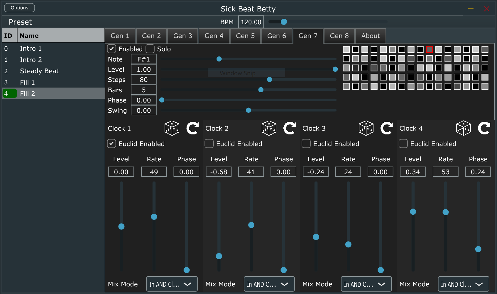
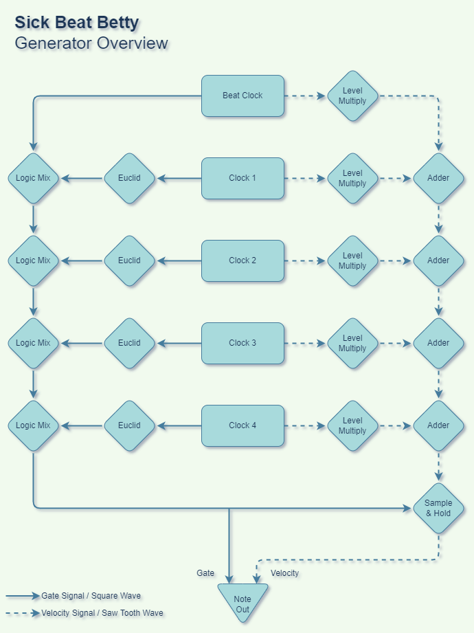

# Sick Beat Betty

A MIDI VST/AU plugin for generating, well, sick beats.  It uses the JUCE library which makes it cross platform so it should build in Linux, Windows, and Mac.

The plugin provides a set of generators that can be targeted towards a specific MIDI note.  This note is then triggered buy the interaction of a collection of square waves, which are themselves generated based off the period of beats and bars assigned to the generator.  Additionally, alongside the square waves, a sawtooth wave is generated with the same period.  These can be mixed to set the velocity of each note trigger, thus giving you a fairly complex set of dynamics.

Here's a basic overview of the clocking arrangement in a single generator:

## Building

### Windows

I'm building with VS Code plus the C++ and cmake extentions.  You'll need to also have the community version of visual studio installed as well, at it uses the compiler for there.

### Linux

TODO  
I haven't yet gotten the Linux build up and tested.

### Mac

TODO  
I haven't yet gotten the Mac build up and tested.
